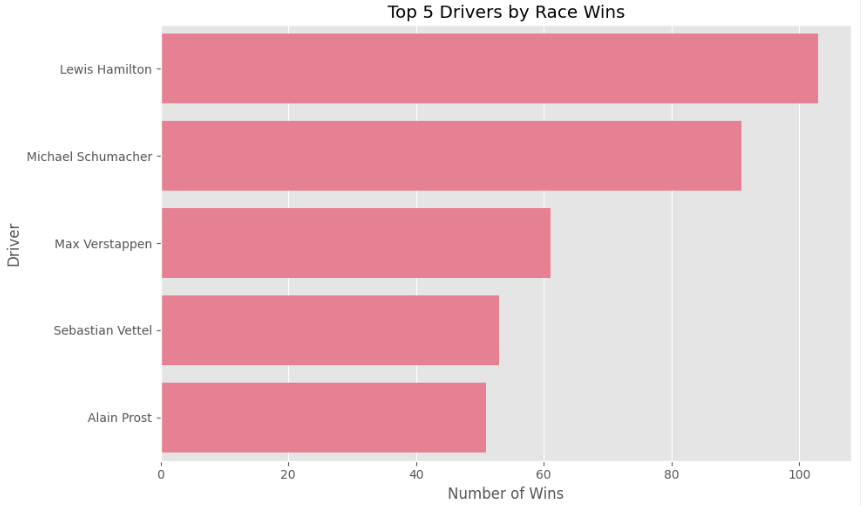
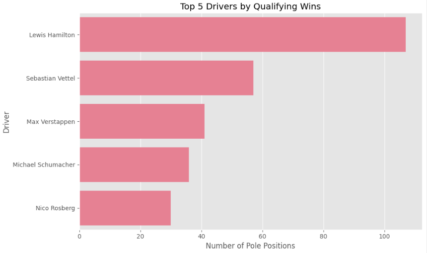
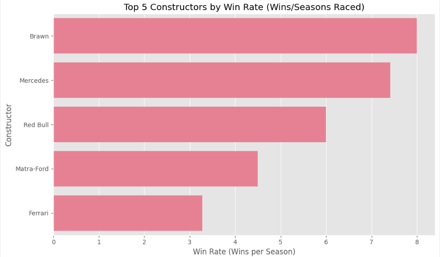
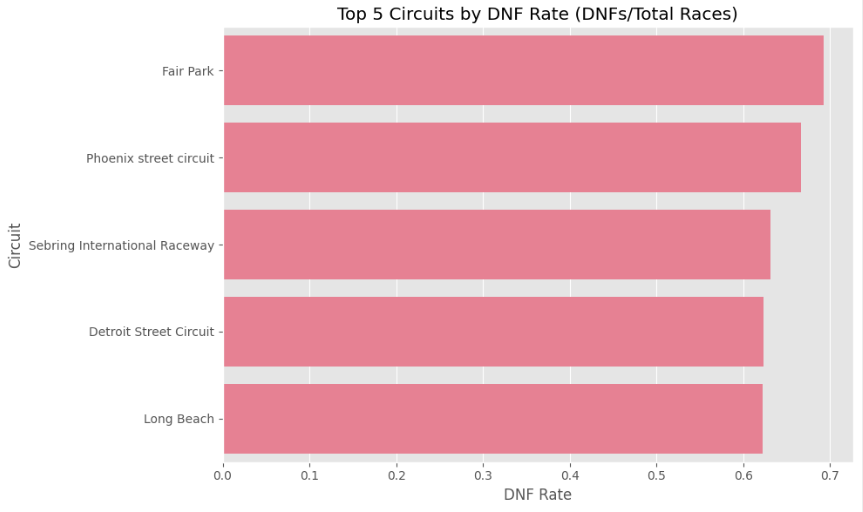
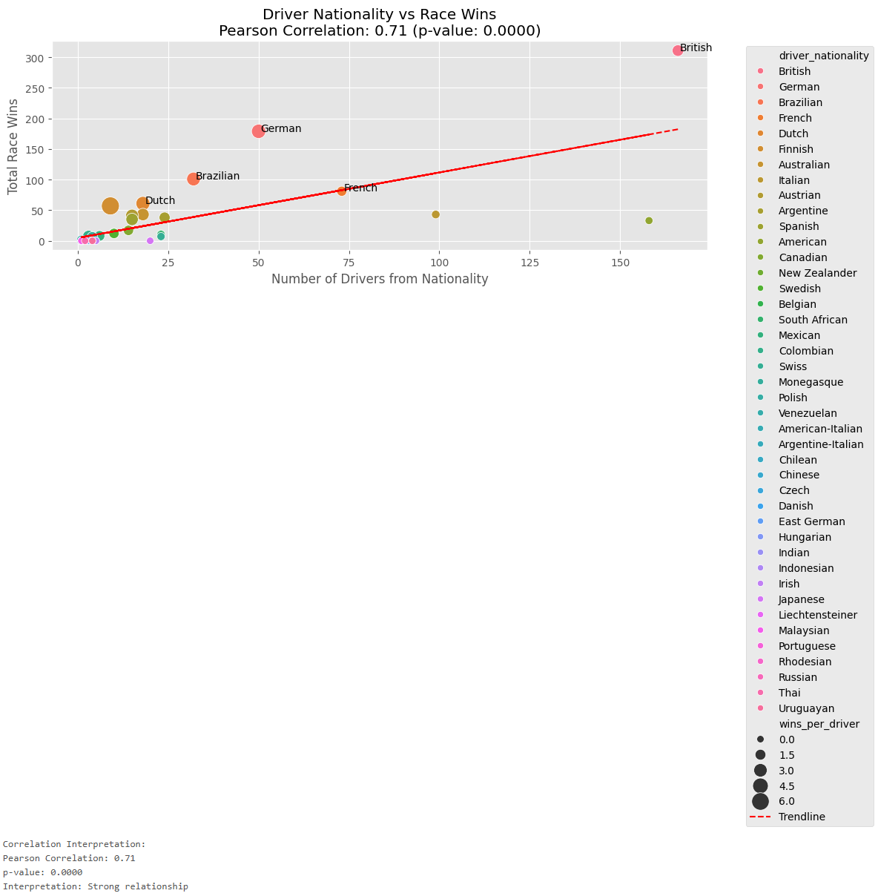
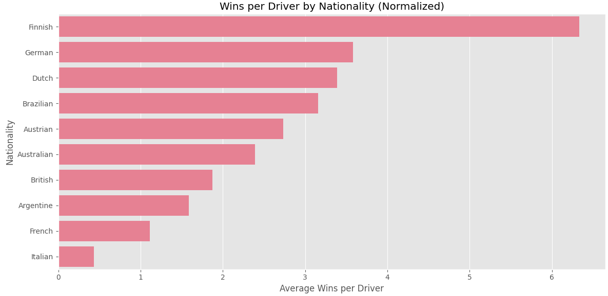

# Data-driven Computing Architectures 2025 - final project - Sami Seppälä

## 1 - Overview

This project implements a data pipeline for processing Formula 1 racing data using Databricks and Medallion Architecture (Bronze → Silver → Gold).

## 2- Contributions

This project was done alone by me, Sami Seppälä

## 3 - Description

This project investigates the Formula 1 World Championship (1950 - 2024) data found on [Kaggle](https://www.kaggle.com/datasets/rohanrao/formula-1-world-championship-1950-2020). The data consists of 14 csv files consisting of all information on the Formula 1 races, drivers, constructors, qualifying, circuits, lap times, pit stops, championships from 1950 till the latest 2024 season. This data is utalized in a reusable ETL pipeline where the data is cleaned and aggregated into a single table where race results are sorted by date.

## 4 - Pipeline ovreview

The pipeline follows the Medallion Architecture:

Bronze Layer: Ingesting of raw data.

Silver Layer: Standardization, deduplication, metadata.

Gold Layer: Aggregation, joining.

Databricks was used for creating the pipeline using their notebook feature where the catalog "ddca_exc4" was created under my organization. All layers and tables were implemented under the ddca_exc4 catalog. Databricks file upload was used to upload the csv files from kaggle to the 
/FileStore/tables/f1_data folder from where they were ingested into the pipeline.

## 5 - Repository Structure

📂
- [README.md](README.md) - Main project report (this file)  
- [code/](code) - Pipeline code, test code, and visualization code  
- [docs/](docs) - Project documentation  
- [misc/](misc) - Empty  
- [data/](data) - Data used  
- [test/](test) - Unit test code  
- [example/](example) - Example of working pipeline
- [images/](images) - Images

## 6 - Example

To demonstrate the pipleine you can check the [example](example/Example_of_working_pipeline.ipynb) notebook. The notebook contains the same pipleine code from the [Final project](code/Final_project.py) file. The unit tests from the [test](test/Test_script.py) file are then ran to ensure all necesarry steps in the pipeline have been performed correctly.

All tests passed.

The visualizations from the [visualization](code/Visualizations.py) file are then performed to gain insight into driver performance.

## Top 5 Drivers by Race Wins

---

## Top 5 Drivers by Qualifying Wins

---

## Top 5 Constructors by Win Rate

---

## Top 5 Circuits by DNF Rate

---

## Correlation Between Driver Nationality and Race Wins

---

## Wins by Nationality (Normalized for Driver Count)

## 7 - Documentation

- [Architecture](docs/architecture.md) - Description of pipeline architecture
- [Pipeline](docs/Architecture.drawio.png) - Visualization of pipeline architecture
- [Code](docs/code_documentation.md) - Code description
## 8 - Conclusion

This project builds a reusable data pipeline for Formual 1 race data using the medallion sctructure. The data is used to gain insight on race winners and create visualizations for different metrics.

## 9 - References

- [Kaggle data](https://www.kaggle.com/datasets/rohanrao/formula-1-world-championship-1950-2020)

- [Databricks documentation](https://docs.databricks.com/aws/en)
